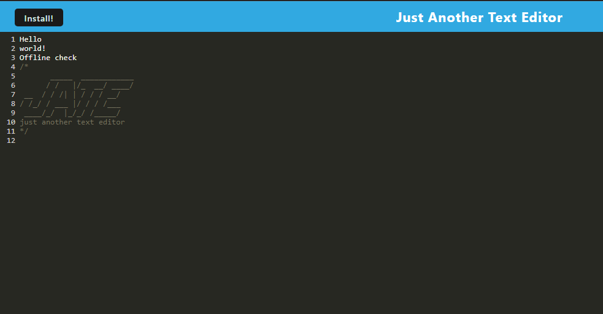

# PWA Text Editor

  
  ## Table of Contents

  - [Description](#description)
  - [Installation](#installation)
  - [Usage](#usage)
  - [Deployment](#deployment)
  - [Tests](#tests)
  - [License](#license)
  - [Questions](#questions)
  
  ## Description

  A text editor able to be installed, or used in the browser, that will remember your notes!

  ## Installation
  
  There is an "Install" button located in the top  left corner.

  ## Usage

  Write down whatever text you would like. To save the text in the database click off the DOM window.

  ## Deployment
  
  https://pwa-text-editor-udbt.onrender.com/

  ## Tests
  
  N/A
  

  ## License
  
  MIT
  

  ## Questions
  
  Have questions about this project? Contact me!
  Email me at: tshankgg@gmail.com,
  or find me on GitHub here: https://github.com/FirefoxFlareon